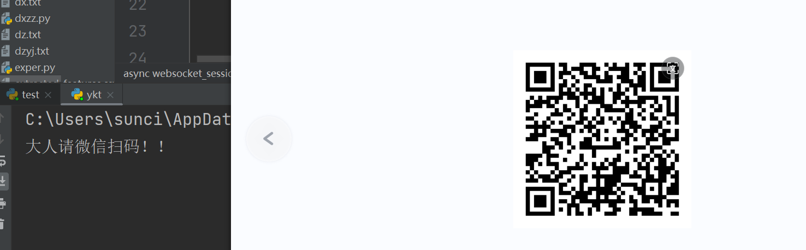
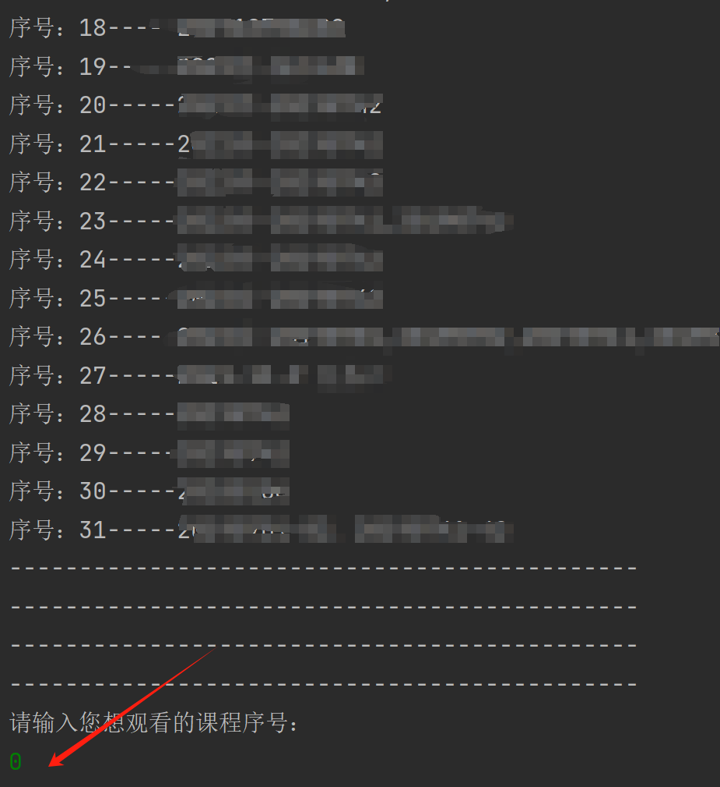
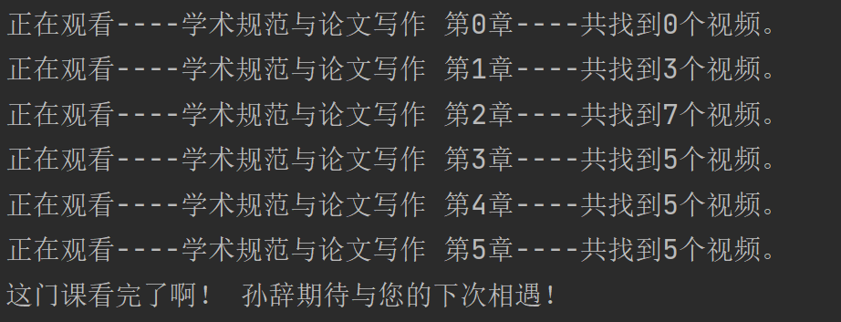

# 雨课堂自动视频观看
## 项目起源
研一的时候想多留点时间跟女友出去玩，但是看着这六门选修网课就神烦，遂写了exe登录刷课软件，那时候思路不佳，还要改密码，再用密码登录就很麻烦，值此毕业之际，重写python版本，直接微信扫码登陆选择课程就好了，一键式傻瓜操作
## 项目对比
网上的不是什么油猴脚本，就是什么要抓包再修改，我这个不用微信扫码登录就行了，遥遥领先！！
再就是只针对西电研究生进行了适配，本科生或者其他学校没适配，自测吧！
## 使用方法
1. 安装python 然后pip install websockets 就可以了 很简单吧
2. 运行脚本就行了
3. 运行之后，脚本会弹出一张微信二维码，扫码登陆就行了，注意请确保你已经在微信上绑定了自己的雨课堂信息！

4. 扫码后，脚本会打印你当前所有课程，然后选择你要观看的课程编号。

5. 等待刷课结束

6. 自行查看成绩

## 声明
本项目仅作交流学习，请勿用于非法用途。
## 题外话
欢迎加入胡门网络安全，学长等你哦！！
